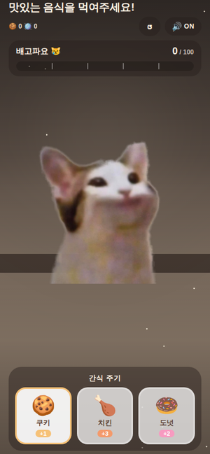
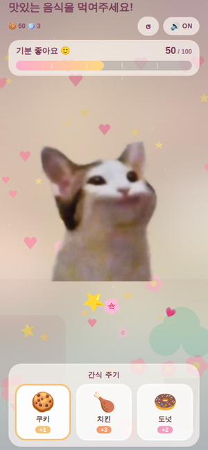
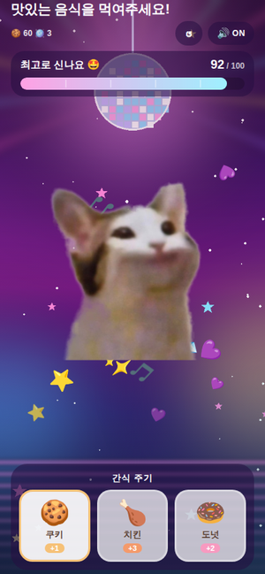
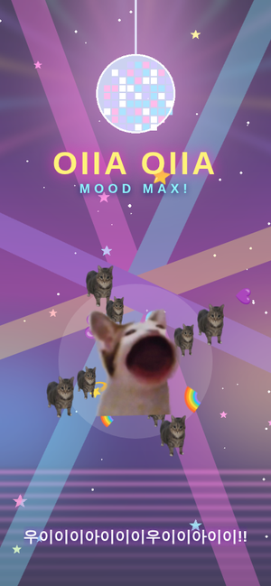
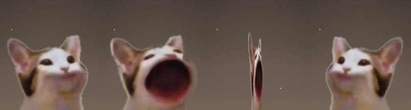

# 맛있는 음식을 먹여주세요! (Popcat OIIA Party)

> 화면·런처에 보이는 이름은 **"맛있는 음식을 먹여주세요!"** 이고,
> 저장소·패키지 식별자(`popcat-oiia-party` / `com.popcat.oiiaparty`)는 그대로 둔다.

팝캣에게 간식을 먹이는 개인용 캐주얼 모바일 게임.
서버·로그인·회원가입·인터넷 통신 없이 **모든 데이터를 기기에만 저장**한다.

> 진짜 보상은 기분 게이지가 MAX가 되었을 때,
> 방금까지 간식을 먹던 **그 팝캣이** OIIA OIIA 사운드와 함께
> 초당 5바퀴로 미친 듯이 회전하고,
> 그 주위를 **OIIA 고양이 8마리가 공전하며 같이 도는** 장면이다.

```
간식 먹이기 → 팝캣 뻐끔 (좌우로 빙글빙글) → 기분 상승 → 배경이 화려해짐
   → 기분 MAX → OIIA OIIA 사운드 → 팝캣 360도 회전 → 파티 종료 → 반복
```

간식은 **누르는 대로 전부** 먹는다. 연타 제한이 없다.
먹을 때마다 팝캣이 수직축으로 반 바퀴씩 돌아 좌우가 뒤집히며,
한 번 먹는 동안 2바퀴를 돌고 정확히 정면으로 돌아온다.

| 기분 0 (시작) | 기분 50 (행복) | 기분 92 (파티 직전) | MOOD MAX (OIIA) |
|---|---|---|---|
|  |  |  |  |

먹을 때마다 좌우가 뒤집히며 도는 모습 (가운데는 정측면을 지나는 순간):



---

## 1. 실행 방법

```bash
npm install
npm start          # Expo 개발 서버 (QR 코드 표시)
```

| 명령 | 설명 |
|---|---|
| `npm start` | Expo 개발 서버 실행 |
| `npm run android` | 연결된 Android 기기/에뮬레이터에서 실행 |
| `npm run web` | 브라우저에서 빠르게 확인 (레이아웃 점검용) |
| `npm test` | 자동 테스트 (55개) |
| `npm run typecheck` | TypeScript 타입 검사 |

## 2. Android 기기 테스트 방법

### 방법 A — Expo Go (가장 빠름, 준비물 없음)

1. 안드로이드 폰 Play 스토어에서 **Expo Go** 설치
2. PC와 폰을 **같은 Wi-Fi**에 연결
3. `npm start` 실행
4. 터미널에 뜬 QR 코드를 Expo Go 앱으로 스캔

Wi-Fi가 다르거나 회사망이라 연결이 안 되면 USB 터널을 쓴다.

```bash
adb reverse tcp:8081 tcp:8081   # USB 디버깅 켜고 케이블 연결한 상태에서
npm start
```

또는 `npx expo start --tunnel` 로 실행한다.

### 방법 B — APK 만들어 설치 (Expo Go 없이 단독 실행)

```bash
npm install -g eas-cli
eas login
eas build -p android --profile preview   # 클라우드 빌드 → APK 다운로드 링크
```

로컬에서 직접 빌드하려면 (Android SDK 필요):

```bash
npx expo prebuild -p android
npx expo run:android
```

> `android/` 폴더는 `.gitignore` 되어 있다. `prebuild` 로 언제든 다시 생성된다.

## 3. 에셋 파일 위치

```
assets/
  images/
    popcat_closed.png     # 입 다문 팝캣 (416 x 443, 투명 배경)
    popcat_open.png       # 입 벌린 팝캣 (416 x 443, 투명 배경)
    background_base.png   # 기분 0~19   차분한 방
    background_cozy.png   # 기분 20~39  포근한 파스텔
    background_happy.png  # 기분 40~59  꽃 / 하트 / 별
    background_party.png  # 기분 60~100 네온 디스코
    oiia_cat.png          # MAX 이벤트에서 함께 도는 OIIA 고양이 (360 x 360)
  snacks/                 # (선택) 간식 이미지 — 없으면 이모지로 자동 fallback
    cookie.png
    chicken.png
    donut.png
  sounds/
    popcat_pop.mp3
    snack_throw.mp3
    snack_eat.mp3
    mood_up.mp3
    mood_max.mp3
    oiia_loop.mp3
    button_click.mp3
```

### 팝캣 프레임 교체 / 재생성

메인 캐릭터는 사용자가 제공한 팝캣 밈 이미지에서 만들었다.
가로로 두 프레임(닫힌 입 / 벌린 입)이 붙어 있는 원본이 있다면 아래로 다시 만들 수 있다.

```bash
pip install Pillow "rembg[cpu]"
python3 tools/make_popcat_frames.py <원본이미지.jpg>
```

이 스크립트는 다음을 보장한다.

- 두 프레임을 정확히 절반으로 분리
- `rembg` 로 배경 제거 → 투명 배경
- 벌린 입 프레임은 닫힌 입 마스크와 합쳐 몸통이 잘리지 않게 보정
- **두 프레임을 동일한 크롭 박스로 잘라 크기·위치를 일치**시킨다
  → 프레임을 교차해도 캐릭터가 흔들리지 않는다

배경 이미지도 스크립트로 생성된다.

```bash
python3 tools/make_backgrounds.py
```

### ⚠️ 에셋 파일은 "삭제"하지 말고 "덮어쓰기"

Metro 번들러는 `require()` 대상 파일을 **번들 시점**에 해석한다.
따라서 파일을 지우면 try/catch 와 무관하게 번들 자체가 실패한다.
저장소에는 모든 에셋이 들어 있으니, 바꾸고 싶으면 **같은 파일명으로 덮어쓰면** 된다.

그럼에도 파일이 손상되어 로드·디코딩에 실패하는 경우를 대비해

- 이미지: `onError` → placeholder / 단색 그라디언트로 대체
- 사운드: 해당 사운드만 무음 처리, 게임은 정상 동작

## 4. 사운드 파일 목록

| 파일 | 재생 시점 |
|---|---|
| `snack_throw.mp3` | 간식 버튼 터치 (던지기) |
| `popcat_pop.mp3` | 팝캣이 입을 벌리는 순간 (뻐끔) |
| `snack_eat.mp3` | 먹기 완료 |
| `mood_up.mp3` | 기분 상승 |
| `mood_max.mp3` | 기분 100 도달 |
| `oiia_loop.mp3` | **OIIA MAX 이벤트 BGM (루프)** |
| `button_click.mp3` | 일반 버튼 |

> **`oiia_loop.mp3` 는 합성한 임시 루프다.**
> 실제 OIIA OIIA 밈 사운드 파일을 구해서 같은 이름으로 덮어쓰면 된다.
> 나머지 효과음도 모두 코드로 합성한 것이라 원하는 소리로 교체해도 된다
> (`python3 tools/make_sounds.py` 로 재생성 가능).

사운드 UX

- 상단 우측 토글로 ON/OFF (설정은 저장된다)
- OFF 면 효과음·BGM 모두 무음
- **앱 진입 직후에는 자동으로 소리를 내지 않는다.** 첫 터치 이후부터 재생된다
- 이벤트가 끝나면 OIIA BGM은 페이드아웃 후 정지
- 사운드 키마다 플레이어를 하나만 만들어 재사용하고, 언마운트 시 모두 해제한다

## 5. 주요 설정값 위치

거의 모든 밸런스/연출 수치는 **`constants/gameConfig.ts`** 한 곳에 있다.

| 값 | 위치 | 기본값 |
|---|---|---|
| 최초 기분 | `INITIAL_MOOD` | `0` (0에서 시작해 직접 채운다) |
| 기분 범위 | `MOOD_MIN` / `MOOD_MAX` | `0` / `100` |
| 감소 속도 | `MOOD_DECAY.intervalMs` / `.amount` | 30초마다 `-1` |
| 화면 갱신 주기 | `MOOD_DECAY.tickMs` | `1000` |
| 간식 비행 시간 | `EAT_CONFIG.flightDuration` | `520ms` |
| 뻐끔 프레임 | `EAT_CONFIG.popFrames` | 100/120/100/120/150ms (2회 뻐끔, 4회 반전) |
| 좌우반전 속도 | `EAT_CONFIG.flipDuration` | `110ms` (반 바퀴) |
| 화면 제목 | `APP_TITLE` | `맛있는 음식을 먹여주세요!` |
| 연타 제한 | `EAT_CONFIG.inputCooldownMs` | `0` (누르는 대로 전부 먹인다) |
| 동시 간식 상한 | `EAT_CONFIG.maxConcurrentSnacks` | `40` (성능 안전장치) |
| **이벤트 길이** | `DJ_CONFIG.eventDuration` | `8000ms` |
| **1회전 시간** | `DJ_CONFIG.rotationDuration` | `200ms` (초당 5바퀴, 총 40회전) |
| **위성 고양이 수** | `DJ_CONFIG.satelliteCount` | `8` |
| 위성 자전 시간 | `DJ_CONFIG.satelliteSpinDuration` | `260ms` |
| 위성 공전 시간 | `DJ_CONFIG.orbitDuration` | `1500ms` |
| **종료 후 기분** | `DJ_CONFIG.resetMood` | `35` |
| 효과음/BGM 볼륨 | `SOUND_CONFIG.sfxVolume` / `.bgmVolume` | `0.85` / `0.7` |
| 기분 단계·문구·파티클 | `MOOD_STAGES` | 6단계 |
| 반응 문구 | `REACTIONS_*` | 랜덤 출력 |

간식 정의(이름/이모지/상승량)는 **`constants/snacks.ts`**:

| 간식 | id | 이모지 | moodGain |
|---|---|---|---|
| 쿠키 | `cookie` | 🍪 | **+1** |
| 치킨 | `chicken` | 🍗 | **+3** |
| 도넛 | `donut` | 🍩 | **+2** |

연타 제한이 없기 때문에 한 번의 터치당 상승폭은 작다.
빠르게 두드릴수록 빨리 차고, 0에서 MAX까지는 치킨 기준 34번이다.

에셋 경로와 입 위치 좌표는 **`constants/assets.ts`** (`POPCAT_MOUTH` 로 간식이 날아갈 목표점을 조정).

## 6. 프로젝트 구조

```
App.tsx                      메인 화면 조립 + 좌표 측정
components/
  PopcatCharacter.tsx        idle 호흡 / 뻐끔 프레임 / OIIA rotateY 회전
  MoodGauge.tsx              0~100 게이지, 수치, 상태 문구
  SnackSelector.tsx          간식 3종 선택 + 터치
  SnackFlying.tsx            간식 포물선 비행
  ParticleEffect.tsx         기분 단계별 파티클
  BurstEffect.tsx            먹을 때 터지는 하트/별
  DynamicBackground.tsx      배경 레이어 opacity 보간
  OiiaPartyOverlay.tsx       ⭐ MAX 이벤트 전체 화면 연출
  OiiaCatSwarm.tsx           팝캣 주위를 공전 + 자전하는 OIIA 고양이 무리
  SoundToggle.tsx            사운드 ON/OFF
  ResetButton.tsx            기록 초기화 버튼
  ConfirmDialog.tsx          되돌릴 수 없는 동작 확인 (Alert 대신 직접 그린다)
hooks/
  useGameState.ts            상태 + 저장/복원 + 먹이기 시퀀스
  useMoodDecay.ts            시간 경과 기분 감소
  useSound.ts                expo-audio 사운드 매니저
services/storage.ts          AsyncStorage 래퍼 + 데이터 검증
constants/                   gameConfig / snacks / assets
utils/mood.ts                기분 계산 순수 함수
utils/anim.ts                빠른 반복 회전용 보간 헬퍼
types/game.ts                타입 정의
tools/                       에셋 생성 스크립트 (Python)
__tests__/                   자동 테스트 55개
```

## 7. 기록 초기화

상단 우측 **↺** 버튼을 누르면 확인 창이 뜨고, 확인해야만 초기화된다.

- 기분 → `0`, 총 간식 → `0`, 총 파티 → `0`
- **사운드 ON/OFF 설정은 유지된다** (진행도가 아니라 환경설정이므로)
- 저장소도 함께 비워지므로 앱을 다시 켜도 초기화 상태가 유지된다
- OIIA 이벤트 중에는 버튼이 비활성화된다

확인 창은 React Native 의 `Alert` 대신 `ConfirmDialog` 로 직접 그렸다.
`Alert` 는 웹(react-native-web)에서 동작하지 않아 플랫폼마다 결과가 달라지기 때문이다.

## 8. 기분 감소가 정확한 이유 (중복 차감 없음)

`setInterval` 로 기분을 "깎지" 않는다. 저장하는 것은 두 값뿐이다.

- `mood` — **`lastInteractionAt` 시점의 기분 값(앵커)**
- `lastInteractionAt` — 마지막 활동 시각

화면에 보이는 기분은 매번 다시 계산한다.

```ts
현재 기분 = clamp(mood - floor((now - lastInteractionAt) / 30000))
```

이 방식이면

- 앱을 종료했다 켜도 경과 시간이 그대로 반영된다
  (예: 12:00에 60 → 12:10에 실행 → 600초 / 30초 = 20 감소 → **40**)
- 백그라운드 ↔ 포그라운드를 몇 번을 오가도 **감소량이 중복 계산되지 않는다**
- 타이머는 화면을 다시 그리는 역할만 하므로 타이머가 겹쳐도 값이 틀어지지 않는다

### 게이지에 마이너스는 없다

기분은 항상 **0 이상 100 이하**다. 음수 개념 자체가 존재하지 않는다.
계산·복원·표시가 모두 같은 `clampMood()` 를 지나기 때문에
아래 어떤 경로로도 음수가 나올 수 없다.

- 시간 경과 감소 — `computeCurrentMood()` 가 0에서 멈춘다 (하루를 방치해도 0)
- 저장 데이터 복원 — `normalize()` 가 음수·NaN·문자열을 0으로 보정한다
- 게이지 렌더링 — 채움 비율을 `0~1` 로 한 번 더 조인다

## 9. 자동 테스트

```bash
npm test
```

55개 테스트 / 6개 스위트, 요구사항의 테스트 시나리오를 코드로 옮긴 것이다.

| 파일 | 커버리지 |
|---|---|
| `mood.test.ts` | 기분 보정, 간식별 상승량(B), 시간 감소(C), 상태 문구·단계(D) |
| `storage.test.ts` | 기본값, 손상 데이터 방어, 저장/복원 왕복(G) |
| `gameFlow.test.ts` | 먹이기 전체 시퀀스와 사운드 순서(A), 연타 동시 처리, MAX 이벤트·리셋(E), 저장(G) |
| `useSound.test.ts` | 첫 터치 전 무음, ON/OFF(F), BGM 정리, 재생 실패 내성 |
| `OiiaPartyOverlay.test.tsx` | 이벤트 텍스트, 8초 자동 종료, 언마운트 타이머 정리 |
| `App.test.tsx` | 사운드 계층이 전부 실패해도 화면이 정상 렌더, 초기화 확인 흐름 |

## 10. 기술 스택

- React Native 0.86 / Expo SDK 57 / TypeScript (strict)
- React Native `Animated` (전부 `useNativeDriver`) — Reanimated 불필요
- `expo-audio` (사운드), `@react-native-async-storage/async-storage` (저장)
- `expo-linear-gradient` (배경 그라디언트), `react-native-safe-area-context`
- 백엔드·DB·로그인 없음

## 11. 라이선스 / 에셋 출처

개인용 프로젝트. 팝캣 캐릭터 이미지는 사용자가 제공한 원본 밈 이미지에서 추출했다.
배경·효과음은 `tools/` 의 스크립트로 생성한 것이다.
